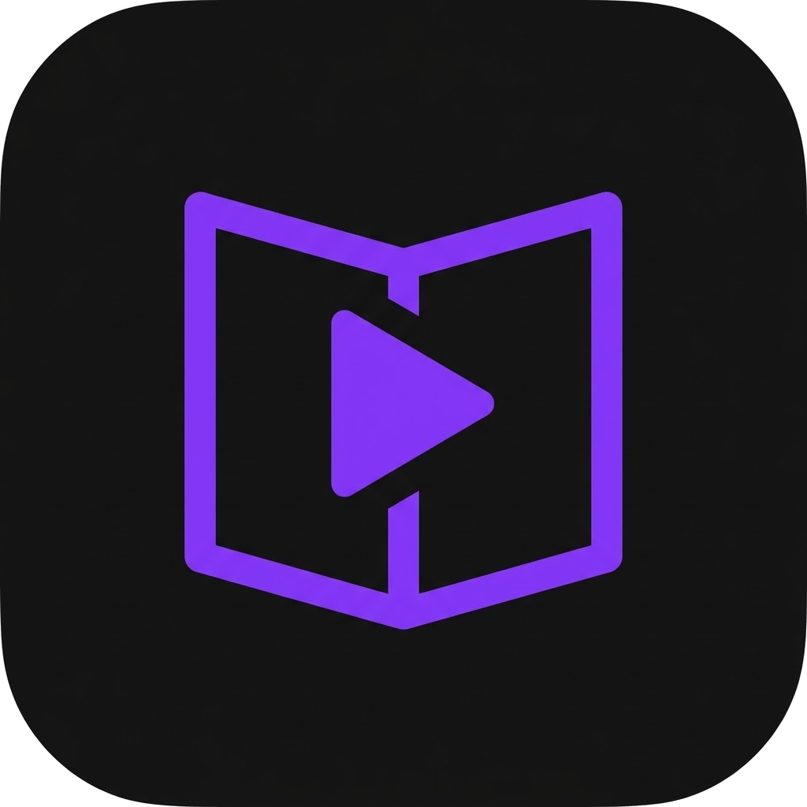

<div align="center">
  

  <h1>Deskemy</h1>

  <p><strong>An offline player for the video courses you already own.</strong></p>

  <p>
    
    
    
    
  </p>
</div>

---

Deskemy is a local, offline player for downloaded video courses. Point it at a
folder of course videos and it organizes them into a browsable library with
playback, progress tracking, search, and study tools. Your video files stay
where they are — they're referenced in place, never copied or uploaded — and
everything Deskemy records lives in a single local SQLite database.

## Features

**Library & import**
- Structures a course folder into sections and ordered lectures, cleaning
  numeric prefixes and extensions out of the titles.
- Attaches sidecar subtitles and resource files (PDFs, code, archives) to the
  lecture or section they belong to.
- Shows a preview of what will be imported — sections, lectures, resources,
  subtitles, total runtime — with live progress during the scan.
- References files in place; it never copies or moves your videos.

**Playback**
- Resume from your last position, autoplay-next, adjustable speed, and per-course
  preferences (speed, subtitle, audio track) that are remembered.
- Chapter navigation, and subtitle / audio-track selection.
- Fullscreen (including from a maximized window) and keyboard shortcuts.

**Organize & revisit**
- Continue Watching on the home screen, resuming the exact lecture you were on.
- Timestamped bookmarks, tags, favorites, and a watch history.
- Career Tracks — ordered groups of courses with aggregate completion.

**Search**
- Full-text search across course, section, and lecture titles.
- Optional subtitle search over the words spoken in your subtitle files, jumping
  straight to the matching timestamp.

**Progress & maintenance**
- Watch-time stats: an activity heatmap, streaks, and a daily goal.
- Rename-safe: a moved or renamed file keeps its progress and bookmarks, matched
  by content rather than path.
- Optional folder auto-rescan, and a storage panel for reclaiming disk space.

## Keyboard shortcuts

| Key | Action | | Key | Action |
|---|---|---|---|---|
| `Space` / `K` | Play / pause | | `C` | Toggle subtitles |
| `J` / `L` | Skip back / forward 10s | | `,` / `.` | Slower / faster |
| `←` / `→` | Skip back / forward 5s | | `N` / `⇧N` | Next / previous lecture |
| `↑` / `↓` | Volume up / down | | `P` / `R` | Course contents / Resources |
| `M` | Mute | | `B` | Bookmark this moment |
| `F` / `Esc` | Fullscreen / exit | | `?` | Show all shortcuts |

## Requirements

- **Windows 10 or 11.**
- **[mpv](https://mpv.io/)** — Deskemy plays through your installed mpv
  (`libmpv-2.dll`) rather than bundling a media engine, so format support and
  playback match mpv exactly. Install it from [mpv.io](https://mpv.io/), or via
  [Scoop](https://scoop.sh/):

  ```powershell
  scoop bucket add extras   # mpv lives in the "extras" bucket
  scoop install mpv
  ```

  Deskemy discovers mpv automatically (including Scoop's install location) and
  prompts you if it can't find it. If needed, point `DESKEMY_LIBMPV` at the
  full path to `libmpv-2.dll`.
- The **WebView2** runtime — installed by the setup program if it's missing.

## Install

1. Download the latest installer (`.exe` or `.msi`) from the releases page.
2. Run it. If mpv isn't already installed, add it (see above).
3. Launch Deskemy → **Add Folder** → pick a course folder.

It's a per-user install (no admin required). Uninstalling from **Settings → Apps**
removes the program, its shortcuts, and its registry entry. Your library index
and settings under `%APPDATA%\com.spooksy.deskemy` are left in place so a
reinstall resumes where you left off — delete that folder for a clean slate.

### Portable (no install)

To run without installing, download the **portable zip**, extract it, and run
`Deskemy.exe`. A `.portable` marker beside the executable keeps all data
(library, settings, thumbnails) in a `data/` folder next to it, so nothing is
written to `%APPDATA%` or the registry. Delete the folder to remove it entirely.
(mpv and the WebView2 runtime still need to be present on the system.)

## Build from source

```bash
# Prerequisites: Node 22+, Rust (stable), MSVC C++ Build Tools, WebView2
npm install
npm run tauri dev      # run in development
npm run tauri build    # build an installer in src-tauri/target/release/bundle/
```

## Tech stack

| Layer | |
|---|---|
| **Frontend** | SvelteKit (`adapter-static` SPA) · Svelte 5 runes · TypeScript · Tailwind v4 |
| **Backend** | Rust · Tauri v2 · SQLite + FTS5 via `rusqlite` (bundled) |
| **Playback** | libmpv, loaded at runtime through FFI (`libloading`) — discovered from the system, not bundled |
| **Storage** | Local SQLite database + a content-addressed thumbnail cache under the app data directory |

Import runs in two phases — probe, then persist — so media probing happens off
the database connection and scanning a large course doesn't block the UI.

## Privacy

No accounts, no telemetry, and no network requests for your content. Your
library, progress, bookmarks, and stats live only in a local database; the app
works fully offline.

## License

[MIT](LICENSE) © 2026 Spooksy.
